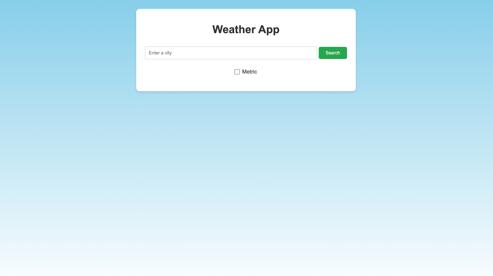
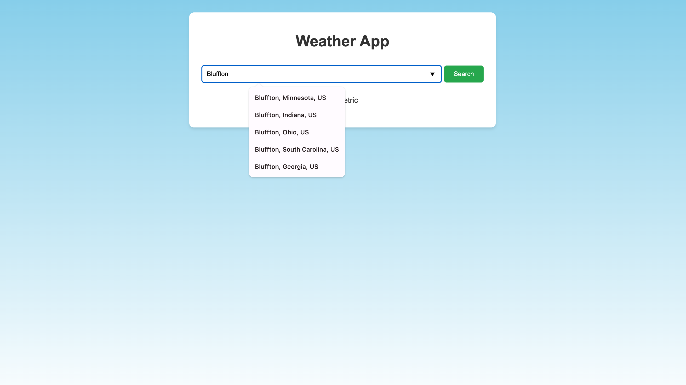
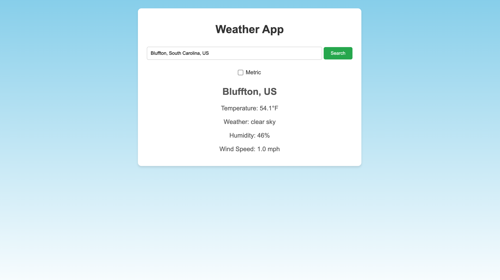
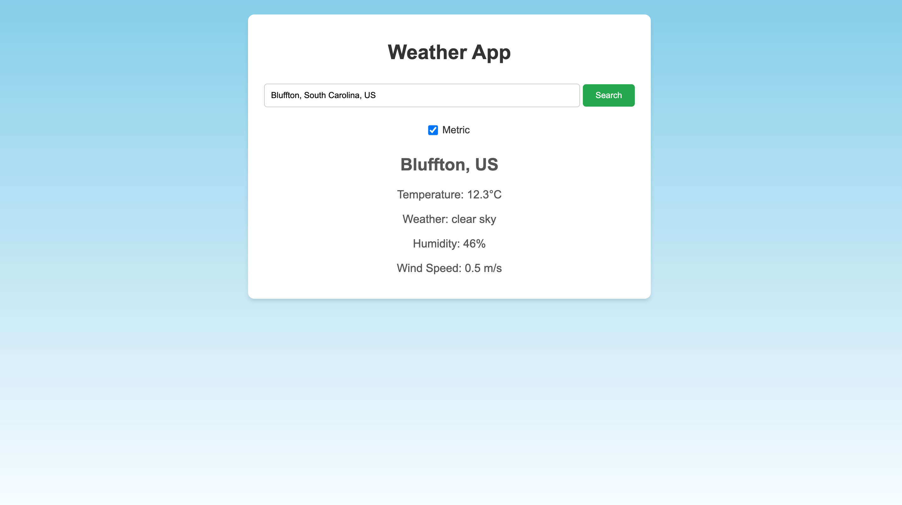

# Weather App

## Overview

The Weather App is a simple web application that allows users to search for and view current weather information for any city. Users can also toggle between metric and imperial units for temperature and wind speed.

## Features

- Autocomplete suggestions for city names.
- Displays current weather details, including:
	- Temperature
	- Weather conditions
	- Humidity
	- Wind speed
- Unit toggle between metric (°C, m/s) and imperial (°F, mph).

## Technologies Used

- **HTML5**: Structure of the web app.
- **CSS3**: Styling and layout.
- **JavaScript**: Logic and API integration.
- **OpenWeatherMap API**: Fetching weather and geocoding data.

## Setup

1. Clone the repository: `git clone https://github.com/your-username/weather-app.git`
2. Create an API key on OpenWeather API.
3. Navigate to the project directory: `cd weather-app`
4. Copy and paste your key into the `your_config.js` file where it says "YOUR_API_KEY".
3. Open `index.html` in a browser.

## Usage

1. Enter a city name in the input field.
2. Select a suggestion from the dropdown (if any).
3. Click the "Search" button to fetch weather data.
4. Toggle the checkbox to switch between metric and imperial units.

## Screenshots

### Home Page

### Drop-down Menu

### Search for Weather Information

### Switch to Metric Units
